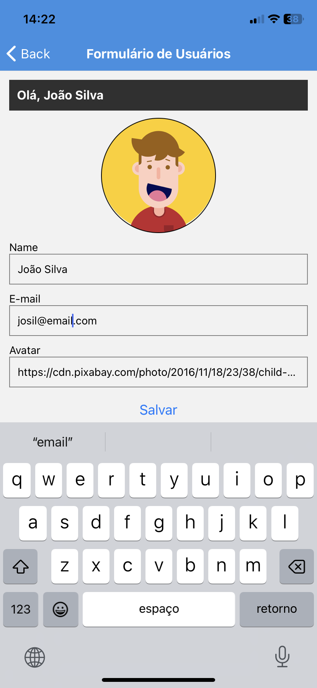
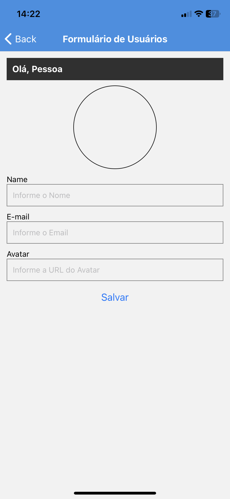

# Aplicação Mobile - Registro de Usuários

## Descrição

Esta é uma aplicação móvel básica desenvolvida como parte do aprendizado em **React Native**. A aplicação permite que os usuários se cadastrem, editem suas informações e excluam suas contas. Para simplificar o desenvolvimento e o aprendizado, os dados são armazenados localmente no dispositivo e não em um banco de dados.

## Funcionalidades

- **Cadastro de Usuários**: Permite que novos usuários se registrem, fornecendo suas informações pessoais.
- **Edição de Dados**: Os usuários podem atualizar suas informações de perfil conforme necessário.
- **Exclusão de Conta**: Oferece a opção de excluir a conta de um usuário, removendo suas informações da aplicação.

 
   
   
   

## Tecnologias Utilizadas

- **JavaScript**: Linguagem de programação principal para o desenvolvimento.
- **React Native**: Framework utilizado para criar a interface móvel.
- **CSS Puro**: Utilizado para estilizar a aplicação e garantir uma apresentação visual atraente.

## Armazenamento de Dados

Os dados dos usuários são armazenados localmente no dispositivo, utilizando armazenamento local para fins de desenvolvimento e aprendizado. Não há integração com um banco de dados externo.

